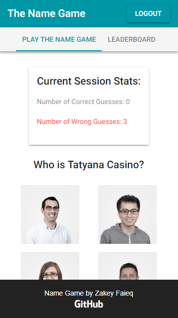

<h1 align="center"> The Name Game </h1>  

  

<a href="https://the-name-game.com"> the-name-game.com </a>   A game that familiarizes you with WillowTree Apps' employees!

## Application Stack and Infrastructure
The Name Game is a simple React SPA that serves as an mobile-friendly interface for the [Name Game API](https://github.com/Zakinator123/name-game-api). It is currently hosted on Firebase.

## Author

* **Zakey Faieq**
* zaf2xk@virginia.edu